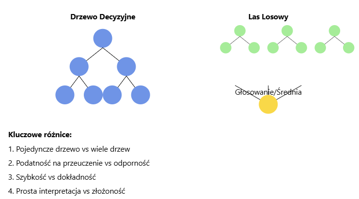
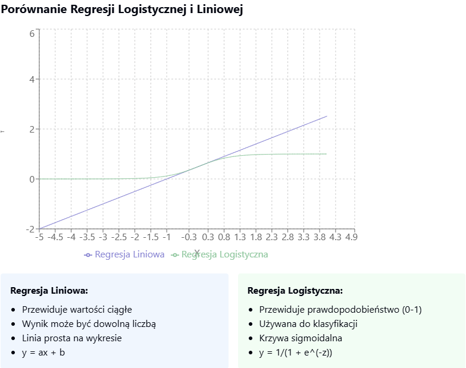
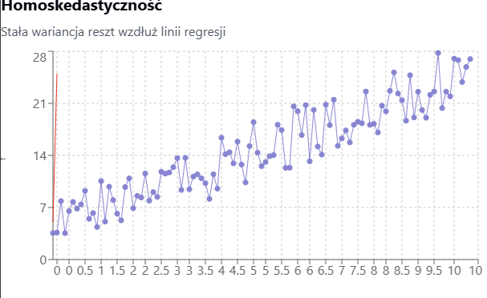
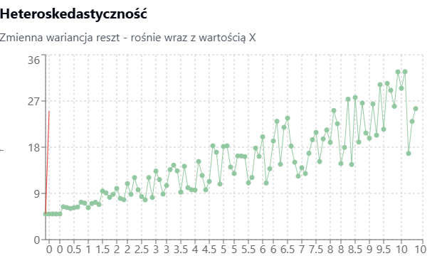

# Rodzaje danych i metody analizy

## Dane ciągłe

### Jakie to dane?

Dane numeryczne, które mogą przyjmować dowolną wartość a określonym przedziale.

### Przykłady metod

- Analiza korelacji: Badanie siły i kierunku związku między zmiennymi (np. współczynnik korelacji Pearsona)
- Regresja liniowa: Modelowanie relacji między zmienną zależną, a niezależnymi.
    - Technika, która pozwala opisać zależność między zmienną zależną Y, a jedną lub wieloma zmiennymi niezależnymi (X)
    - Pozwala na przewidywanie przyszłych wartości
    - Analizy związków - ocenia siłę i kierunek zależności między zmiennymi

## Szeregi czasowe

### Jakie to dane?

Dane zorganizowane w sposób chronologiczny

### Przykłady metod

- Dekompozycja - rozkład szeregu czasowego na komponenty - trend, sezonowość, reszty
    - Trend - długoterminowy kierunek zmian w danych, np. sprzedaż lodów w trakcie dekady → ignoruje krótkie wahania, ważna ogólna tendencja
    - Sezonowość - regularne, cykliczne wzorce powtarzające się w określonych interwałach, np. co rok → jest przewidywalna, może wynikać z czynników kulturowych, pogodowych czy gospodarczych
    - Reszty - nie da się wyjaśnić przez trend ani sezonowość, np. niespodziewane spadki sprzedaży lodów z powodu jednorazowego wydarzenia → pozwala ocenić, jak dobrze model (trend + sezonowość) opisuje dane, reszty powinny przypominać szum losowy

## Dane kategoryczne

### Jakie to dane?

Dane podzielone na kategorie (np. płeć, kolory)

### Przykłady metod

- Tabele krzyżowe - prezentacja relacji między zmiennymi kategoriami
- Test chi-kwadrat - ocena, czy istnieje związek między zmiennymi kategorycznymi

# Techniki modelowania statystycznego

## Regresja liniowa

Modelowanie relacji między zmienną zależną, a niezależnymi.

- Technika, która pozwala opisać zależność między zmienną zależną Y, a jedną lub wieloma zmiennymi niezależnymi (X) (np. sprzedaż na podstawie wydatków na reklamę)
- Pozwala na przewidywanie przyszłych wartości  (np. jak zmiana temperatury wpływa na sprzedaż lodów)
- Analizy związków - ocenia siłę i kierunek zależności między zmiennymi

### Dla jakich danych?

- Relacja między zmiennymi jest liniowa - zależność powinna przypominać linię prostą
- Dane są niezależne
- Homoskedastyczność - rozrzut błędów powinien być stały w całym zakresie zmiennych niezależnych
- Rozkład normalny błędów

### Modele:

#### 1. Drzewa decyzyjne (DecisionTreeClassifier/DecisionTreeRegressor):
- Model przypominający strukturę drzewa
- Podejmuje decyzje poprzez sekwencję pytań "tak/nie"
- Prosty w interpretacji, ale może być podatny na przeuczenie
- Jest szybki

#### 2. Lasy losowe (RandomForestClassifier/RandomForestRegressor):
- Zbiór wielu drzew decyzyjnych
- Bardziej odporny na przeuczenie niż pojedyncze drzewo
- Zazwyczaj daje lepsze wyniki niż pojedyncze modele
- Jest wolny ale dokładniejszy
- Bardziej złożony niż pojedyncze drzewo

#### 3. Regresja logistyczna (LogisticRegression):
- Model dla problemów klasyfikacji binarnej
- Przewiduje prawdopodobieństwo przynależności do klasy, analiza ryzyka, diagnoza medyczna
- Dobry dla prostych zależności liniowych

#### 4. Regresja liniowa (LinearRegression):
- Model dla problemów regresji
- Znajduje liniową zależność między zmiennymi np. prognozowanie sprzedaży, przewidywanie temperatur
- Prosty i szybki, ale zakłada liniowość

Miary oceny:
1. Accuracy (dokładność):
- Procent poprawnie sklasyfikowanych przypadków
- Dla problemów klasyfikacji

2. F1 Score:
- Średnia harmoniczna precyzji i czułości
- Dobra dla niezbalansowanych klas

3. R² (R-kwadrat):
- Miara dopasowania modelu regresji
- Wartości od 0 do 1 (im bliżej 1, tym lepiej)

Do zapamiętania:
- Klasyfikacja to przewidywanie kategorii (np. spam/nie spam)
- Regresja to przewidywanie wartości liczbowych (np. cena domu)

Pytanie dodatkowe:

### 1. Czym jest współczynnik korelacji Pearsona?
Jest to miara siły liniowego związku między zmiennymi.
Przyjmuje wartości od -1 do 1
Gdzie:

1 oznacza idealną korelację dodatnią
-1 oznacza idealną korelację ujemną
0 oznacza brak korelacji liniowej

### 2. Homoskedastyczność
- Punkty danych rozpraszają się wokół linii regresji (czerwona linia) ze stałą wariancją
- Rozrzut punktów jest podobny niezależnie od wartości X
- To pożądana cecha w analizie regresji

### 3. Heteroskedastyczność
- Wariancja reszt zwiększa się wraz ze wzrostem wartości X
- Punkty są bardziej rozproszone po prawej stronie wykresu
- Może prowadzić do nieefektywnych estymatorów w analizie regresji

### 4. Co to jest rozkład normalny danych
Zwany też rozkładem Gaussa
Charakteryzuje się symetrycznym rozkładem wokół średniej
Ma kształt dzwonu
### 5. Testy statystyczne
Test t-Studenta:
Porównuje średnie dwóch grup
Sprawdza istotność różnic

Test chi-kwadrat:
Sprawdza zależności między zmiennymi kategorycznymi

Test Shapiro-Wilka:
Sprawdza normalność rozkładu

ANOVA:
Analiza wariancji dla wielu grup

Test Manna-Whitneya:
Nieparametryczna alternatywa dla testu t-Studenta

### 6. Heatmapy
Wizualna reprezentacja danych w formie macierzy
Kolory reprezentują wartości
Zastosowania:
- Wizualizacja korelacji między zmiennymi
- Przedstawienie wzorców w danych

### 7. Wariancja 
Opisuje jak bardzo dane różnią się od średniej wartości zbioru.
- 50, 50, 50, 50 - średnia 50, wariancja 0
- 20, 40, 60, 80 - średnia 50, wariancja duża